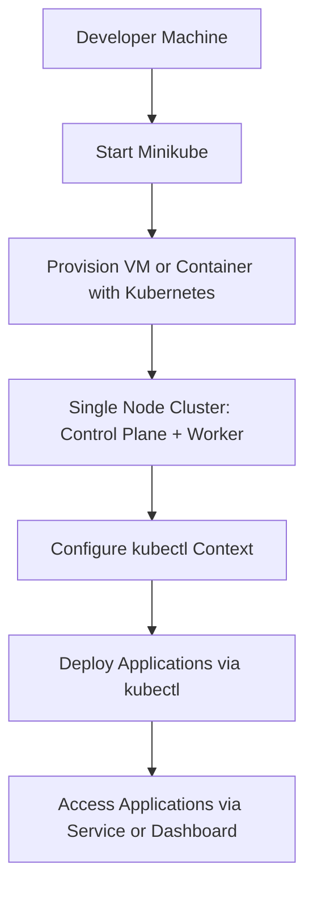
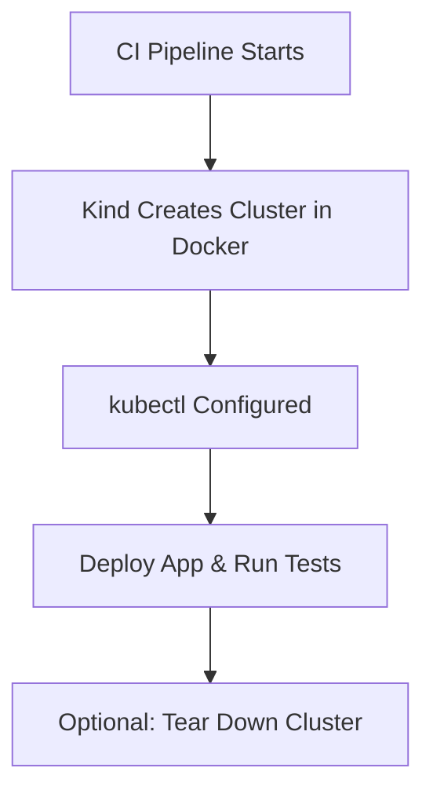

<div align ="center"><h2>Kubernetes</h2></div>

 **Kubernetes**
> Kubernetes is an open-source container orchestration platform used to automate the deployment, scaling, and management of containerized applications. It simplifies the process of managing applications by automating tasks like scaling, monitoring, and updating, making it easier to run distributed applications at scale.

## Architecture Diagram


### Kubernetes Master Node
In Kubernetes (k8s), a master node is the **control plane component** responsible for managing the cluster. It coordinates and schedules tasks, maintains cluster state, and monitors node health. It includes components like <b>API server, scheduler, etcd and controller manager</b>, ensuring overall cluster functionality and orchestration of containerized applications.

#### API Server
* The API server `(kube-apiserver)` exposes the Kubernetes API to enable **requests** to the cluster from **inside and outside** of the cluster.

#### etcd
* etcd is a highly available key-value store that helps **maintain** the **state** of your Kubernetes cluster and configuration  details like subnets and config maps in Kubernetes database. 

#### Scheduler
* `Kube-scheduler` assigns **tasks** to worker nodes and manages **new requests** from the API Server, ensuring they are directed to healthy nodes.

#### Controller Manager
* `Kube Controller Manager` task is to **retrieve** the desired **state** from the API Server.

<i>If the desired state does not match the current state of the object, corrective steps are taken by the control loop to align the current state with the desired state.</i>

### Kubernetes Worker Node
Worker nodes in a cluster are machines or servers running applications, controlled by the Kubernetes master. Multiple nodes connect to the master. On each node, multiple [pods](#pods) and containers operate.

#### Kubelet
* Kubelet an **agent** on each node, **communicates** with the master. It ensures pod **containers health**, executing tasks like deploying or **destroying containers**, reporting back to the Master.

#### Kube-proxy
* Kube-proxy enables worker node communication, managing **network rules**. It ensures rules are set for containers to communicate across nodes.

#### container Runtime
* Container Runtime, **responsible** for container **execution**, supports multiple runtimes: Docker, containers.
  
<b>Guide:</b> [Kubernetes](https://k21academy.com/docker-kubernetes/kubernetes-architecture-components-overview-for-beginners/)

<p align="center"></div>

> ## How does Kubernetes work?
> When you write a YAML file like `deployment.yaml`, you're basically telling Kubernetes, “Hey, I need 3 copies of my app running forever.” This request is received by the Kubernetes master, where several key components work together to make it happen.
>
> ### Components of the Workflow:
>
> - 🗨️ **Kube-API Server:**  
>   “Got it! Let me check how many nodes are free.”
>
> - 🗨️ **Scheduler:**  
>   “Okay, I found some free nodes. Let’s get those Pods running.”
>
> - 🗨️ **Controller Manager:**  
>   “I’m on it! I’ll make sure the right number of Pods are always running. If one crashes, I’ll create a new one.”
>
> - 🗨️ **Container Runtime:**  
>   “I'm creating the pod.”
>
> - 🗨️ **kubelet:**  
>   “I’m watching over the Pods on this node and reporting their status back to the master.”


### 🧾 Kubernetes workloads
> A Kubernetes workload is an application that runs on Kubernetes.

> A workload can be composed of a single component or multiple components working together, but it must run within a set of pods.

> In Kubernetes, each pod has a defined lifecycle, and it represents a collection of running containers.

#### 1. ReplicaSet
* A ReplicaSet ensures that a specified number of pods are running at any given time.
* It acts as a self-healing mechanism, automatically replacing failed or deleted pods.
* ReplicaSets provide basic scaling and availability features.
* Let’s look at the spec field inside.
    * `.spec.replicas` denotes the number of replicas – the number of instances of the pod you would be running.
    * `.spec.selector` contains the matchLabels field among others which contains a map of key-value pairs used to match labels on pods.
    * `.spec.template` contains the pod template that is used to create the replicas. These replicas are then managed by the ReplicaSet.
#### 2. Deployments
* Run stateless applications.
* It is the preferred way to deploy an application inside a pod.
* It is a higher-level abstraction built on top of ReplicaSets that uses ReplicaSets internally to manage applications.
* In addition to the work carried out by a ReplicaSet, it provides added functionality such as:
    * Rolling Updates
        > Rolling updates ensure that an application is updated gradually, one replica at a time, while ensuring that the overall availability of the application is not impacted.
    * Rollback
        > Deployments automatically rollback to a previous version of an application if an update fails.
    * Version Control
      > Similar to the previous feature, Deployments implement version control, hence allowing for the ability to rollback to a previous specific version.

#### 3. StatefulSet
* StatefulSet is the controller that manages the deployment and scaling of a set of Stateful pods.
* A stateful pod in Kubernetes is a pod that requires persistent storage and a stable network identity to maintain its state all the time, even during pod restarts or rescheduling.
  
## 🔹 Posibilities for setting up a kubernetes cluster
### 1. ☁️ Cloud Providers (Managed Kubernetes)

<p align="center"></div>

**Stack:**
> Hardware → Operating System → Container Runtime → Containers (App + Binaries only, no full OS inside).

**How it works**:
* Instead of full VMs, we package apps and their dependencies into lightweight containers.
* All containers share the host OS kernel via the container runtime.
* Kubernetes orchestrates these containers: schedules, scales, and manages them.
### Sample pod .yaml file
#### Create
```bash
kubectl create -f simple-pod.yml
```
#### Script
```bash
apiVersion: v1
kind: Pod
metadata:
  name: nginx
spec:
  containers:
  - name: nginx
    image: nginx:1.14.2
    ports:
    - containerPort: 80
```
#### Run
```bash
kubectl apply -f simple-pod.yaml
```
### 2. 🖥️ Local Kubernetes (For Development/Testing)
#### 🛠️ Tools:
* **Minikube – Single-node cluster**
> Minikube is a tool that allows you to run a single-node Kubernetes cluster on your local machine. It’s primarily used for development and testing purposes when you don’t want to set up a full Kubernetes cluster.



```bash
C:\Users\sreem\Azure-projects> minikube start
>>
😄  minikube v1.35.0 on Microsoft Windows 10 Home Single Language 10.0.19045.5737 Build 19045.5737
✨  Automatically selected the docker driver
📌  Using Docker Desktop driver with root privileges
👍  Starting "minikube" primary control-plane node in "minikube" cluster
🚜  Pulling base image v0.0.46 ...
💾  Downloading Kubernetes v1.32.0 preload ...
    > preloaded-images-k8s-v18-v1...:  333.57 MiB / 333.57 MiB  100.00% 94.85 K
    > gcr.io/k8s-minikube/kicbase...:  500.31 MiB / 500.31 MiB  100.00% 123.23
🔥  Creating docker container (CPUs=2, Memory=2200MB) ...
💡  To pull new external images, you may need to configure a proxy: https://minikube.sigs.k8s.io/docs/reference/networking/proxy/
🐳  Preparing Kubernetes v1.32.0 on Docker 27.4.1 ...
    ▪ Booting up control plane ...
    ▪ Configuring RBAC rules ...
    ▪ Using image gcr.io/k8s-minikube/storage-provisioner:v5
🏄  Done! kubectl is now configured to use "minikube" cluster and "default" namespace by default
```
* **Kind (Kubernetes IN Docker) – For CI pipelines**
> Kind stands for Kubernetes IN Docker.It’s a tool for running Kubernetes clusters inside Docker containers—**no VMs needed**!


##### Sample dockerfile
```bash
      - name: Install Kind & kubectl
        run: |
          curl -Lo ./kind https://kind.sigs.k8s.io/dl/v0.20.0/kind-linux-amd64
          chmod +x ./kind && sudo mv ./kind /usr/local/bin/kind
          sudo snap install kubectl --classic

      - name: Create Kind Cluster
        run: kind create cluster

      - name: Deploy App & Run Tests
        run: |
          kubectl apply -f deployment.yaml
          kubectl wait --for=condition=available deployment/my-app --timeout=60s
          # Run integration tests
          ./run-tests.sh
```
* **GUI tools**
* Rancher Desktop
  > Run a local Kubernetes cluster (via k3s)

  `Use nerdctl or kubectl for CLI access`
* Docker Desktop
  > Run Docker containers

  `Use GUI or Docker CLI (docker build, docker run).Use GUI or Docker CLI (docker build, docker run)'
  
### 3. 🏢 On-Premises Infrastructure (Manual Setup on VMs or Bare Metal)
#### 🛠️ Tools: 
* **kubeadm(setup the cluster)**
    > Tool to set up (initialize) a Kubernetes cluster easily.
* **kubectl(manage the cluster)**
    > Command-line tool to interact with the Kubernetes cluster.
* **kubelet(Runs on each node to maintain containers)**
    > An agent that runs on every node (master and worker) and ensures the containers are running as expected.

  <p align="center"></div>

## Benefits of Managed Kubernetes

### * Scalability
The decoupled architectural support of Kubernetes makes it easy to scale containerized applications to meet business requirements.

### * Accelerated Deployment
With managed Kubernetes, teams can spin up a cluster in minutes, with all configuration tasks completed by the Kubernetes vendor.

### * Minimized Management
A managed Kubernetes vendor takes care of all maintenance tasks, keeping the cluster up-to-date and scaling easily.

### * Freed Up Developers
The right managed Kubernetes solution allows developers to focus on generating business value, rather than troubleshooting Kubernetes deployments.

### * Predictable Cost
A managed solution enables IT teams to better predict the monthly cost of running a Kubernetes implementation.

### * Improved Security
Managed Kubernetes providers bring expertise in cloud-based security, helping to protect the expanded attack surface that containers can create.

## Concepts in kubernetes

| Category | Explanation |
|:---------|:------------|
| **Cluster Architecture** | Describes how Kubernetes is built: the Control Plane manages the system, Nodes run applications, and components like etcd, scheduler, and controller manager coordinate the cluster. |
| **Containers** | Kubernetes uses containers (like Docker) to package, run, start, stop, and restart applications across the cluster. |
| **Workloads** | Types of tasks Kubernetes runs: **Deployments** (rolling updates), **StatefulSets** (apps needing stable storage), **DaemonSets** (run a pod on every node), **Jobs** (tasks that run to completion). |
| **Services, Load Balancing, and Networking** | Kubernetes manages app networking: **Services** expose apps, **load balancing** shares traffic, and **service discovery** helps apps find each other. |
| **Storage** | Kubernetes supports **persistent storage** using volumes and **dynamic provisioning** to automatically create storage for applications. |
| **Configuration** | Uses **ConfigMaps** for non-sensitive configuration data and **Secrets** for sensitive data like passwords, keeping application configuration clean and secure. |
| **Security** | Manages **Authentication** (verifying identity), **Authorization** (controlling access), and **Secrets management** (safely storing confidential information). |
| **Policies** | Sets cluster rules: **PodSecurity** (control pod behavior), **NetworkPolicies** (manage pod communication), **ResourceQuotas** (limit resource usage). |
| **Scheduling, Preemption, and Eviction** | Kubernetes **schedules** pods to the right nodes, can **preempt** lower-priority pods if needed, and **evicts** pods when resources are low. |
| **Cluster Administration** | Covers setting up, maintaining, scaling, monitoring, and upgrading the Kubernetes cluster. |
| **Windows in Kubernetes** | Supports running Windows containers alongside Linux containers within the same Kubernetes cluster. |
| **Extending Kubernetes** | Add new features using **CRDs** (Custom Resources), **APIs**, **Webhooks**, and **Operators** that automate complex app management tasks. |


[Know more about Concepts](https://kubernetes.io/docs/concepts/)

## RBAC(Role-based access control)

## Pods
* A Kubernetes pod is a **set of containers** on a single host, sharing storage and network.
* A pod is the smallest unit that exists in Kubernetes. It is similar to that of tokens in C or C++ languages.
* It includes specifications for container execution, enabling easy inter-container communication.

### Pods in two many ways
* **Pods that run a single container.** The `one-container-per-Pod` model is the most common Kubernetes use case; in this case, you can think of a Pod as a wrapper around a single container; Kubernetes manages Pods rather than managing the containers directly.

* **Pods that run multiple containers** that need to work together. A Pod can **encapsulate** an application composed of multiple co-located containers that are tightly coupled and need to share resources. These co-located containers form a single cohesive unit.
  
## configMap
* In Kubernetes, Configmap is an API object that is mainly used to store non-confidential data. The data that is stored in ConfigMap is stored as key-value pairs.

## Installation
### Docker
[docker](https://www.docker.com/get-started/)
### Verify installation
```bash
docker version
```
### Kubectl
[kubectl](https://kubernetes.io/docs/tasks/tools/install-kubectl-windows/)
### minikube
[minikube](https://minikube.sigs.k8s.io/docs/start/)
### Verify installation
```bash
minikube version
```
```bash
minikube start
```
## Deployment of single pods
### Pod- sample code
```bash
apiVersion: v1
kind: Pod
metadata:
  name: nginx
spec:
  containers:
  - name: nginx
    image: nginx:1.14.2
    ports:
    - containerPort: 80
```

```bash
kubectl apply -f pod.yaml
```
> Output : pod/nginx created

```bash
kubectl get pods
```
> output : NAME    READY   STATUS              RESTARTS   AGE
nginx   0/1     ContainerCreating   0          3s

## Deployment of 3 pods(replicas)
### Pod- sample code
```bash
apiVersion: apps/v1
kind: Deployment
metadata:
  name: nginx-deployment
  labels:
    app: nginx
spec:
  replicas: 3
  selector:
    matchLabels:
      app: nginx
  template:
    metadata:
      labels:
        app: nginx
    spec:
      containers:
      - name: nginx
        image: nginx:1.14.2
        ports:
        - containerPort: 80

```

```bash
kubectl apply -f nginx-deployment.yaml
```
> Output : deployment.apps/nginx-deployment created

```bash
kubectl get deployments
```
> output : NAME               READY   UP-TO-DATE   AVAILABLE   AGE
nginx-deployment   3/3     3            3           19s

## Deploy III-tier application in aks
**Step 1:** Create a Dockerfile for base image
```
 FROM node:16 AS build

     WORKDIR /app


     COPY package.json package-lock.json ./
    RUN npm config set timeout 600000 \
    && npm config set registry https://registry.npmmirror.com \
   && npm config set strict-ssl false

 COPY . .
 RUN npm install --offline || npm install --legacy-peer-deps --force

 RUN npm run build

 FROM nginx:alpine
 COPY --from=build /app/build /usr/share/nginx/html
EXPOSE 80
CMD ["nginx", "-g", "daemon off;"]
```
**Step 2** Create a `docker-compose.yml ` in `.githb/workflows ` folder
```
name: Build & Push image to ACR

on:
  push:
    branches:
      - main

permissions:
  id-token: write
  contents: read

jobs:
  build-and-push:
    runs-on: ubuntu-latest
    steps:
    - name: Checkout Repository
      uses: actions/checkout@v3

    # Login to Azure using OIDC authentication
    - name: Login to Azure
      uses: azure/login@v1
      with:
        client-id: ${{ secrets.AZURE_CLIENT_ID }}
        tenant-id: ${{ secrets.AZURE_TENANT_ID }}
        subscription-id: ${{ secrets.AZURE_SUBSCRIPTION_ID }}

    # Login to Azure Container Registry (ACR)
    - name: Login to Azure Container Registry (ACR)
      run: |
        echo "${{ secrets.REGISTRY_PASSWORD }}" | docker login ${{ secrets.ACR_NAME }}.azurecr.io -u ${{ secrets.REGISTRY_USERNAME }} --password-stdin

    # Build and Push Frontend Image
    - name: Build and Push Frontend
      run: |
        docker build -t ${{ secrets.ACR_NAME }}.azurecr.io/frontend:latest ./react-hooks-frontend
        docker push ${{ secrets.ACR_NAME }}.azurecr.io/frontend:latest

    # Build and Push Backend Image with Database Secrets
    - name: Build and Push Backend
      run: |
        docker build \
          --build-arg DB_HOST=${{ secrets.DB_HOST }} \
          --build-arg DB_PORT=${{ secrets.DB_PORT }} \
          --build-arg DB_USER=${{ secrets.DB_USER }} \
          --build-arg DB_PASSWORD=${{ secrets.DB_PASSWORD }} \
          --build-arg DB_NAME=${{ secrets.DB_NAME }} \
          -t ${{ secrets.ACR_NAME }}.azurecr.io/backend:latest ./springboot-backend

        docker push ${{ secrets.ACR_NAME }}.azurecr.io/backend:latest
```
**Step 3:** Create `frontend-deployment.yaml`
```
apiVersion: apps/v1
kind: Deployment
metadata:
  name: frontend
spec:
  replicas: 2
  selector:
    matchLabels:
      app: frontend
  template:
    metadata:
      labels:
        app: frontend
    spec:
      containers:
        - name: frontend
          image: <your-acr-name>.azurecr.io/frontend:latest
          ports:
            - containerPort: 80
---
apiVersion: v1
kind: Service
metadata:
  name: frontend-service
spec:
  type: LoadBalancer
  selector:
    app: frontend
  ports:
    - port: 80
      targetPort: 80
```
**Step 4:** Merge aks cluster and ACR in CLI
```
az aks update -n namespacecluster -g portfolio --attach-acr akscontainerregistry22
```
**Step 5:** Verify the pod running
<p align="center"></div>

**Step 6:** Run the application
<p align="center"></div>

<p align="center"></div>


