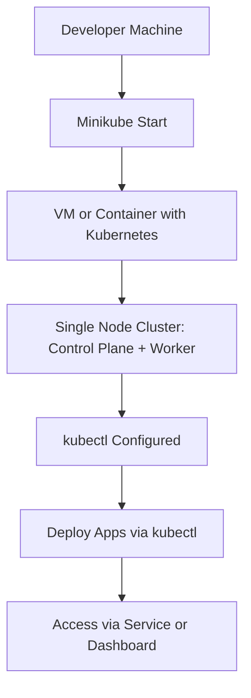
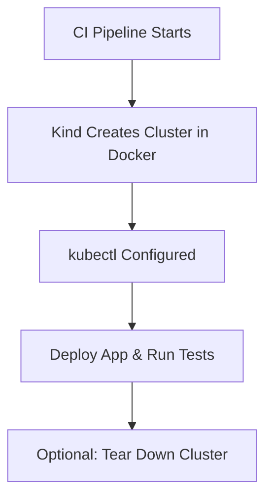

<div align ="center"><h2>Kubernetes</h2></div>

 **Kubernetes**
> Kubernetes is an open-source container orchestration platform used to automate the deployment, scaling, and management of containerized applications. It simplifies the process of managing applications by automating tasks like scaling, monitoring, and updating, making it easier to run distributed applications at scale.

## Architecture Diagram


### Kubernetes Master Node
In Kubernetes (k8s), a master node is the **control plane component** responsible for managing the cluster. It coordinates and schedules tasks, maintains cluster state, and monitors node health. It includes components like <b>API server, scheduler, etcd and controller manager</b>, ensuring overall cluster functionality and orchestration of containerized applications.

#### API Server
* The API server `(kube-apiserver)` exposes the Kubernetes API to enable **requests** to the cluster from **inside and outside** of the cluster.

#### etcd
* etcd is a highly available key-value store that helps **maintain** the **state** of your Kubernetes cluster and configuration  details like subnets and config maps in Kubernetes database. 

#### Schedular
* `Kube-scheduler` assigns **tasks** to worker nodes and manages **new requests** from the API Server, ensuring they are directed to healthy nodes.

#### Controller Manager
* `Kube Controller Manager` task is to **retrieve** the desired **state** from the API Server.

<i>If the desired state does not match the current state of the object, corrective steps are taken by the control loop to align the current state with the desired state.</i>

### Kubernetes Worker Node
Worker nodes in a cluster are machines or servers running applications, controlled by the Kubernetes master. Multiple nodes connect to the master. On each node, multiple [pods](#pods) and containers operate.

#### Kubelet
* Kubelet an **agent** on each node, **communicates** with the master. It ensures pod **containers health**, executing tasks like deploying or **destroying containers**, reporting back to the Master.

#### Kube-proxy
* Kube-proxy enables worker node communication, managing **network rules**. It ensures rules are set for containers to communicate across nodes.

#### container Runtime
* Container Runtime, **responsible** for container **execution**, supports multiple runtimes: Docker, containers.
  
<b>Guide:</b> [Kubernetes](https://k21academy.com/docker-kubernetes/kubernetes-architecture-components-overview-for-beginners/)

## How does Kubernetes work?
When you write a YAML file like `deployment.yaml`, you're basically telling Kubernetes, “Hey, I need 3 copies of my app running forever.” This request is received by the Kubernetes master, where several key components work together to make it happen.

### Components of the Workflow:

- 🗨️ **Kube-API Server:**  
  “Got it! Let me check how many nodes are free.”

- 🗨️ **Scheduler:**  
  “Okay, I found some free nodes. Let’s get those Pods running.”

- 🗨️ **Controller Manager:**  
  “I’m on it! I’ll make sure the right number of Pods are always running. If one crashes, I’ll create a new one.”

- 🗨️ **Worker Nodes:**  
  “We’re ready! We’ve got the containers up and running.”

- 🗨️ **kubelet:**  
  “I’m watching over the Pods on this node and reporting their status back to the master
  
## 🔹 Posibilities for setting up a kubernetes cluster
### 1. ☁️ Cloud Providers (Managed Kubernetes)


**Stack:**
> App → Binaries inside Containers → Container Runtime (like Docker) → OS → Hardware

**How it works**:
* Instead of full VMs, we package apps and their dependencies into lightweight containers.
* All containers share the host OS kernel via the container runtime.
* Kubernetes orchestrates these containers: schedules, scales, and manages them.
### Sample pod .yaml file
#### Create
```bash
kubectl create -f simple-pod.yml
```
#### Script
```bash
apiVersion: v1
kind: Pod
metadata:
  name: nginx
spec:
  containers:
  - name: nginx
    image: nginx:1.14.2
    ports:
    - containerPort: 80
```
#### Run
```bash
kubectl apply -f simple-pod.yaml
```
### 🧾 Kubernetes Resource objects

| **Kind**                      | **Purpose**                                                                 |
|------------------------------|------------------------------------------------------------------------------|
| Pod                        | The smallest unit — runs one or more containers.                            |
| Deployment                 | Manages a set of Pods — scaling, updating, and healing automatically.       |
| ReplicaSet                 | Ensures a certain number of Pod replicas are running. Used by Deployments.  |
| StatefulSet                | Like Deployment, but for **stateful apps** (e.g., databases).               |
| DaemonSet                  | Ensures **one Pod per node** (e.g., for log collectors or monitoring).      |
| Job                        | Runs a task **once** and exits successfully (e.g., batch jobs).             |
| CronJob                    | Schedules Jobs to run on a **time schedule** (like a Linux cron).           |
| Service                    | Exposes Pods as a **network service** (ClusterIP, NodePort, LoadBalancer). |
| Ingress                    | Manages **external access** to Services via HTTP/HTTPS.                     |
| ConfigMap                  | Stores **non-confidential** config data separately from app code.           |
| Secret                     | Stores **confidential** data like passwords and API keys.                   |
| PersistentVolume (PV)      | Represents **storage resources** (e.g., disks).                             |
| PersistentVolumeClaim (PVC)| Requests storage from a PersistentVolume.                                   |
| Namespace                  | Provides **isolated environments** within a cluster.                        |
| Role / ClusterRole         | Defines permissions within a namespace or across the whole cluster.         |
| RoleBinding / ClusterRoleBinding | Assigns roles to users or services.                                     |

### 2. 🖥️ Local Kubernetes (For Development/Testing)
#### 🛠️ Tools:
* **Minikube – Single-node cluster**
> Minikube is a tool that allows you to run a single-node Kubernetes cluster on your local machine. It’s primarily used for development and testing purposes when you don’t want to set up a full Kubernetes cluster.
 

```bash
C:\Users\sreem\Azure-projects> minikube start
>>
😄  minikube v1.35.0 on Microsoft Windows 10 Home Single Language 10.0.19045.5737 Build 19045.5737
✨  Automatically selected the docker driver
📌  Using Docker Desktop driver with root privileges
👍  Starting "minikube" primary control-plane node in "minikube" cluster
🚜  Pulling base image v0.0.46 ...
💾  Downloading Kubernetes v1.32.0 preload ...
    > preloaded-images-k8s-v18-v1...:  333.57 MiB / 333.57 MiB  100.00% 94.85 K
    > gcr.io/k8s-minikube/kicbase...:  500.31 MiB / 500.31 MiB  100.00% 123.23
🔥  Creating docker container (CPUs=2, Memory=2200MB) ...
💡  To pull new external images, you may need to configure a proxy: https://minikube.sigs.k8s.io/docs/reference/networking/proxy/
🐳  Preparing Kubernetes v1.32.0 on Docker 27.4.1 ...
    ▪ Booting up control plane ...
    ▪ Configuring RBAC rules ...
    ▪ Using image gcr.io/k8s-minikube/storage-provisioner:v5
🏄  Done! kubectl is now configured to use "minikube" cluster and "default" namespace by default
```
* **Kind (Kubernetes IN Docker) – For CI pipelines**
> Kind stands for Kubernetes IN Docker.It’s a tool for running Kubernetes clusters inside Docker containers—**no VMs needed**!

##### Sample dockerfile
```bash
      - name: Install Kind & kubectl
        run: |
          curl -Lo ./kind https://kind.sigs.k8s.io/dl/v0.20.0/kind-linux-amd64
          chmod +x ./kind && sudo mv ./kind /usr/local/bin/kind
          sudo snap install kubectl --classic

      - name: Create Kind Cluster
        run: kind create cluster

      - name: Deploy App & Run Tests
        run: |
          kubectl apply -f deployment.yaml
          kubectl wait --for=condition=available deployment/my-app --timeout=60s
          # Run integration tests
          ./run-tests.sh
```
* **GUI tools**
* Rancher Desktop
  > Run a local Kubernetes cluster (via k3s)

  `Use nerdctl or kubectl for CLI access`
* Docker Desktop
  > Run Docker containers

  `Use GUI or Docker CLI (docker build, docker run).Use GUI or Docker CLI (docker build, docker run)'
  
### 3. 🏢 On-Premises Infrastructure (Manual Setup on VMs or Bare Metal)
#### 🛠️ Tools: 
* kubeadm
* kubectl
* kubelet

## Pods
* A Kubernetes pod is a **set of containers** on a single host, sharing storage and network.
* A pod is the smallest unit that exists in Kubernetes. It is similar to that of tokens in C or C++ languages.
* It includes specifications for container execution, enabling easy inter-container communication.

### Pods in two many ways
* **Pods that run a single container.** The `one-container-per-Pod` model is the most common Kubernetes use case; in this case, you can think of a Pod as a wrapper around a single container; Kubernetes manages Pods rather than managing the containers directly.

* **Pods that run multiple containers** that need to work together. A Pod can **encapsulate** an application composed of multiple co-located containers that are tightly coupled and need to share resources. These co-located containers form a single cohesive unit.
  
## configMap
* In Kubernetes, Configmap is an API object that is mainly used to store non-confidential data. The data that is stored in ConfigMap is stored as key-value pairs.

## Installation
### Docker
[docker](https://www.docker.com/get-started/)
### Verify installation
```bash
docker version
```
### Kubectl
[kubectl](https://kubernetes.io/docs/tasks/tools/install-kubectl-windows/)
### minikube
[minikube](https://minikube.sigs.k8s.io/docs/start/)
### Verify installation
```bash
minikube version
```
```bash
minikube start
```
## Deployment of single pods
### Pod- sample code
```bash
apiVersion: v1
kind: Pod
metadata:
  name: nginx
spec:
  containers:
  - name: nginx
    image: nginx:1.14.2
    ports:
    - containerPort: 80
```

```bash
kubectl apply -f pod.yaml
```
> Output : pod/nginx created

```bash
kubectl get pods
```
> output : NAME    READY   STATUS              RESTARTS   AGE
nginx   0/1     ContainerCreating   0          3s

## Deployment of 3 pods(replicas)
### Pod- sample code
```bash
apiVersion: apps/v1
kind: Deployment
metadata:
  name: nginx-deployment
  labels:
    app: nginx
spec:
  replicas: 3
  selector:
    matchLabels:
      app: nginx
  template:
    metadata:
      labels:
        app: nginx
    spec:
      containers:
      - name: nginx
        image: nginx:1.14.2
        ports:
        - containerPort: 80

```

```bash
kubectl apply -f nginx-deployment.yaml
```
> Output : deployment.apps/nginx-deployment created

```bash
kubectl get deployments
```
> output : NAME               READY   UP-TO-DATE   AVAILABLE   AGE
nginx-deployment   3/3     3            3           19s

