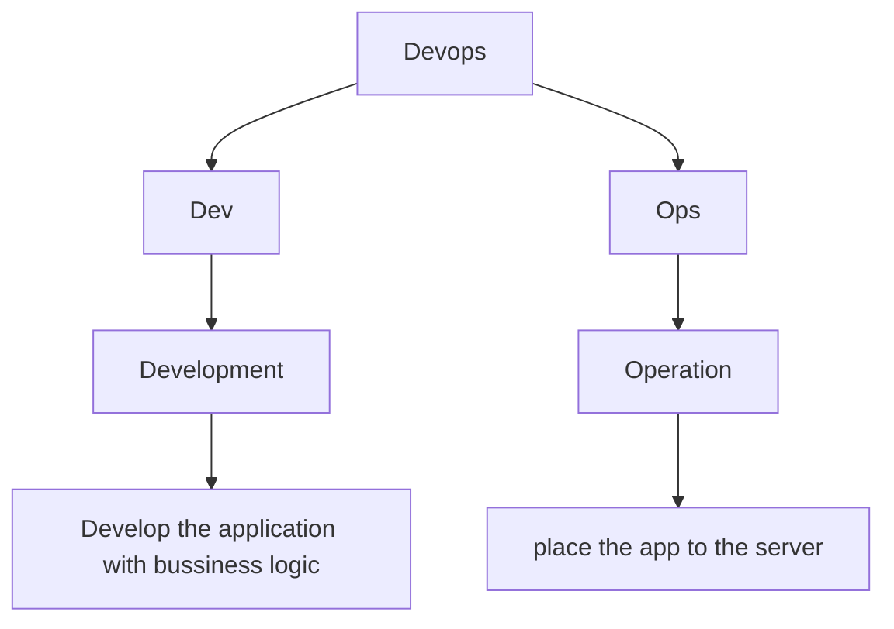

<div align="center">
<h2>DevOps Azure - 2024</h2>
</div>

## Devops
DevOps, short for Development and Operations, is a set of practices, tools, and a cultural philosophy that aims to improve collaboration between software development (Dev) and IT operations (Ops). The primary purpose of DevOps is to shorten the software development lifecycle while ensuring high-quality software delivery.


# DevOps Learning & Project Guide

This document covers foundational DevOps knowledge and a practical EMS Ops 3-tier application deployment task on Azure.

---

## 1. Linux Basics

### File System Navigation
- `ls`, `cd`, `pwd`, `mv`, `cp`, `rm`

### Permissions Management
- File and directory permissions: `chmod`, `chown`

### User and Group Management
- Create users and groups: `useradd`, `groupadd`, `passwd`

### Process Management
- View and manage processes: `ps`, `top`, `kill`

### System Monitoring Tools
- Disk usage and memory: `df`, `du`, `free`

### Networking & Remote Access
- Basic commands: `ping`, `curl`
- Remote access: `ssh`

---

## 2. Bash Scripting

### Basics
- Script structure, comments, execution permissions
- Variables, conditionals: `if`, `else`
- Loops: `for`, `while`

### Input & Automation
- Read user input, script arguments: `$1`, `$2`
- Automate tasks

### Scheduling with Cron
# CRONTAB – Linux

## What is Crontab?

Crontab helps you **automate tasks** by scheduling jobs to run at specific times.  
It uses `cron`, a **time-based job scheduler** in Unix-like operating systems.  
You can use it to run **commands** or **scripts** automatically without manual intervention.

---

## Common Crontab Commands

| Command        | Description                              |
|----------------|------------------------------------------|
| `crontab -e`   | Open the crontab file in the editor      |
| `crontab -l`   | List existing crontab entries            |
| `crontab -r`   | Remove the crontab file                  |
| `crontab -u`   | Specify the crontab for a particular user|

## Crontab Syntax

Each line in a crontab file follows the syntax:


*/15 * * * * /path/to/backup.sh  -> it run every 15 minutes 

---

## 3. Git & GitHub

### Git Basics
- Setup and initialization: `git init`
- Staging and committing: `git add`, `git commit`
- View history: `git log`
- Branching, merging, undoing changes

### Remote Repositories
Clone an existing repository from a remote source (e.g., GitHub):
```bash
git clone https://github.com/username/repository.git
```
### GitHub Workflows
- Create a GitHub account
- Create and manage repositories
- Fork, pull requests, and code reviews
### Push Changes to Remote

Push your local commits to the remote repository:

```bash
git push origin main
```
### Pull Changes from Remote
Pull the latest changes from the remote repository into your current branch:
```
git pull origin main
```
### Fetch Updates from Remote
Fetch updates from the remote repository without merging into your working branch:
```
git fetch origin
```
---
## 4. Docker

### Images & Containers
- `docker pull`, `docker images`, `docker build`
- `docker run`, `docker ps`, `docker stop`, `docker start`, `docker restart`, `docker rm`
- `docker exec`, `docker logs`, `docker inspect`

### Networking
- `docker network create`, `docker network ls`

### System Info
- `docker system df`, `docker stats`, `docker info`
  
[Refer](https://github.com/Sruthi-22012002/DevOps-Azure/tree/main/Docker)

---
## 5. Azure DevOps & Cloud

### Azure Basics
- Azure Definition
- Create Azure Account
- Login to Azure Account
- External User Access

### VM & Connectivity
- Connect VM using SSH
- Connect VM using Bastion Host
- Connect VM using Bastion Services

### Databases
- Flexible MySQL Server (Azure managed MySQL)

### Scalability
- VMSS (Virtual Machine Scale Sets)

### Application Deployment – 3-Tier App
- **Frontend**: ReactJS  
- **Backend**: Spring Boot  
- **Database**: MySQL  
- **Network**: Virtual Network (VNet), 3 Subnets, NSGs  
- **Access Rules**: Proper SSH and isolation configurations
  
[manual deployment](https://github.com/Sruthi-22012002/ems-ops-phase-1)

### DNS Services
- Azure DNS

### Container Apps
- Deploy Container App Manually
- Deploy Container App via Automation

### Orchestration & Security
- Kubernetes (AKS)
- Role-Based Access Control (RBAC)

[Refer](https://github.com/Sruthi-22012002/DevOps-Azure/tree/main/Azure)

---

## 6. Terraform

- Infrastructure as Code (IaC)
- Automating cloud resource provisioning
- Working with `terraform init`, `plan`, `apply`
- Managing state files
  
[Refer](https://github.com/Sruthi-22012002/Jumisa-Technologies-Private-Limited)

---

## 7. Jasper Report Server

- Setup and configuration
- Report generation and scheduling
- User and permission management
  
[Refer](https://github.com/Sruthi-22012002/DevOps-Azure/blob/main/Azure/JasperReports.md)

---

## 8. GitLab

- GitLab installation (including on Docker)
- GitLab CI/CD pipelines
- GitLab Runner configuration
- Repository management and collaboration
  
[Refer](https://github.com/Sruthi-22012002/AWS/blob/main/gitlab_CICD.md)

---

## 9. Google Cloud Platform (GCP)

### VPC Resources
- Creating and managing Virtual Private Cloud networks

### Database
- Setting up and connecting to cloud-hosted databases

### Secret Manager
- Store and retrieve secrets securely

### SSH Configuration
- How to connect to VM instances via SSH
- Key-based authentication setup
  
[Refer](https://github.com/Sruthi-22012002/gcp/blob/main/README.md)

---
## 10. AWS
### Infrastructure Deployment

[Refer](https://github.com/Sruthi-22012002/AWS/tree/main)
