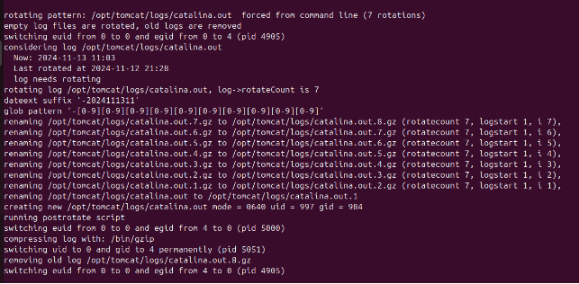

`                  `**Logrotae configuration**

**Step1:Configure Logrotate for Hourly Rotation**
**
`           `sudo nano /etc/logrotate.d/tomcat

**Step2:Adding the following configuration to manage the catalina.out log file:**                                           	/opt/tomcat/logs/catalina.out { 

`          `hourly 

`          `rotate 7 

`          `compress 

`          `missingok 

`          `notifempty 

`          `create 0640 tomcat tomcat 

`           `postrotate 

`                  `systemctl restart tomcat 

`           `endscript 

}

- **hourly**: Rotate the logs every hour.
- **rotate 7**: Keep 7 hours of logs.
- **compress**: Compress old log files to save space.
- **missingok**: Do not throw an error if the log file is missing.
- **notifempty**: Do not rotate the log if it is empty.
- **create 0640 tomcat tomcat**: Create a new log file with specified permissions and ownership after rotation.
- **postrotate**: Runs a command (like reloading a service) after rotating logs.

**Step3:Setup a cron job to run the script every minute**
**
`           `crontab -e**           

`            `0 \* \* \* \* /usr/sbin/logrotate /etc/logrotate.conf

**Step4:Check the Logrotate Status File**
**
`             `cat /var/lib/logrotate/status

**Step5:Run Logrotate in Debug Mode**
**
`            `sudo logrotate -vf /etc/logrotate.conf

`     `**1**.**Rotation Details**:

1. The log file is set to keep a maximum of 7 rotations. 
   1. Old logs are renamed sequentially (e.g., catalina.out.7.gz becomes catalina.out.8.gz, and so on).
   1. The current log file (catalina.out) is renamed to catalina.out.1.

1. **Creating a New Log File**:
   1. A new catalina.out file is created with specified permissions (640) and ownership (uid = 997, gid = 984).

1. **postrotate ... endscript Execution**:
   1. ` `The commands between these directives are executed after the logs are rotated. In this case, it uses systemctl reload tomcat to send a signal to Tomcat, prompting it to reopen its log files.

1. **Compression**:
   1. The old logs are compressed using gzip,to save disk space.

1. **Removing Old Logs**:
   1. The oldest rotated log file (catalina.out.8.gz) is removed .
